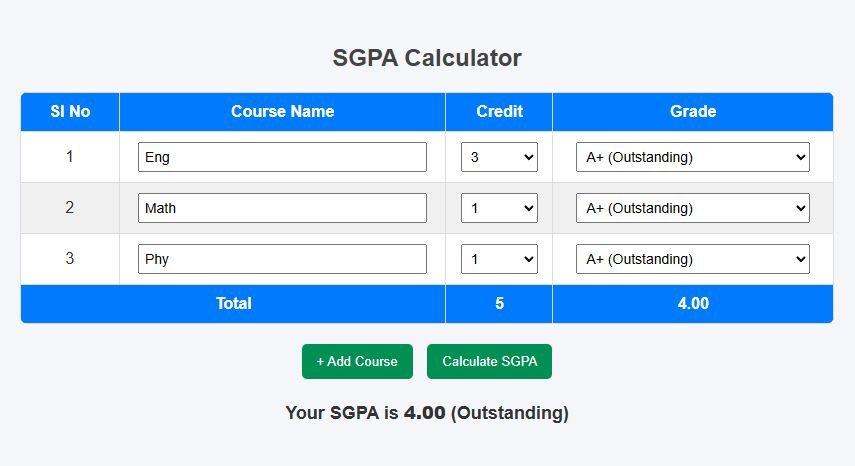

# 📊 SGPA Calculator

A simple **web-based SGPA calculator** to help students calculate their Semester Grade Point Average (SGPA) easily. Users can enter course names, select credits, and select grades from a dropdown menu. The calculator will automatically calculate total credits and SGPA along with remarks.

---
## 🔗 Live Demo
🚀 [Click Here to Try Payoo Now](https://mahbub-zaman.github.io/SGPA-Calculator/)

---

## 🚩 Features

- Add multiple courses dynamically
- Select **Credit** and **Grade** manually
- Automatically calculate **Total Credits** and **SGPA**
- Shows **Remarks** based on SGPA
- Alternating row colors for better readability
- Clean and responsive UI

---

## 📕 Grading System

| Marks Obtained (%) | Grade | Grade Point | Remarks          |
|------------------|-------|------------|----------------|
| 80% and above     | A+    | 4.00       | Outstanding     |
| 75% to less than 80% | A     | 3.75       | Excellent       |
| 70% to less than 75% | A-    | 3.50       | Very Good       |
| 65% to less than 70% | B+    | 3.25       | Good            |
| 60% to less than 65% | B     | 3.00       | Satisfactory   |
| 55% to less than 60% | B-    | 2.75       | Above Average  |
| 50% to less than 55% | C+    | 2.50       | Average        |
| 45% to less than 50% | C     | 2.25       | Below Average  |
| 40% to less than 45% | D     | 2.00       | Pass           |
| Less than 40%       | F     | 0.00       | Fail           |

---

## ⚙️ How to Use

1. Open `index.html` in a web browser.
2. Enter your **course names**.
3. Select **credit hours** for each course.
4. Select the **grade** for each course from the dropdown menu.
5. Click **Calculate SGPA** to see your **SGPA** and **remarks**.
6. Add more courses by clicking **+ Add Course**.

---

## 📸 Demo Screenshot

 <!-- Optional: add an image of your app -->

---

## 🛠️ Technologies Used

- **HTML** – For the structure of the web page
- **CSS** – For styling, alternating row colors, and layout
- **JavaScript** – For calculating SGPA, handling dynamic rows, and remarks

---

## 🔰 Creator

- **Name**: MD: Mahbub Zaman  
- **Role**: Software Engineer , Mern stack Developer
- **Contact**: [Social Media Link](https://www.facebook.com/IamMahbubZaman) 
- **About**: I am currently a student in the Software Engineering department at Daffodil International University. I am learning web development with a focus on MERN stack and passionate about building efficient, modern web applications.  
- **LinkedIn**: [Visit my LinkedIn Profile](https://www.linkedin.com/in/yourprofile)

- **GitHub**: [Visit my  GitHub Profile](https://github.com/Mahbub-Zaman)
- **Personal Website**: Currently not available.
---